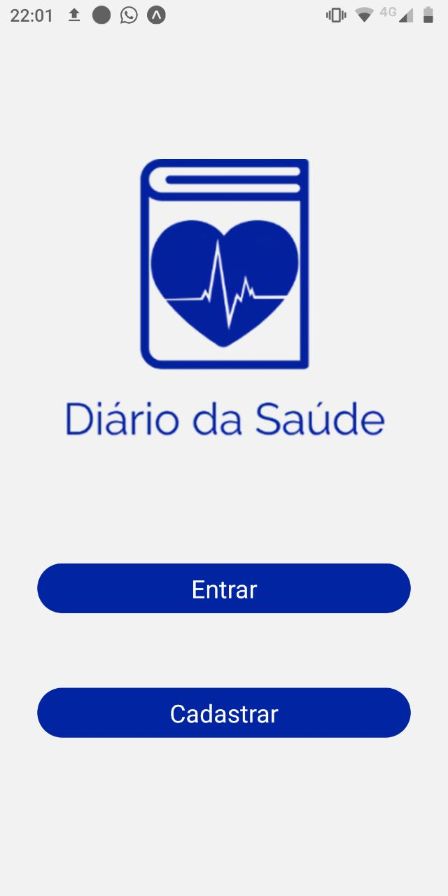
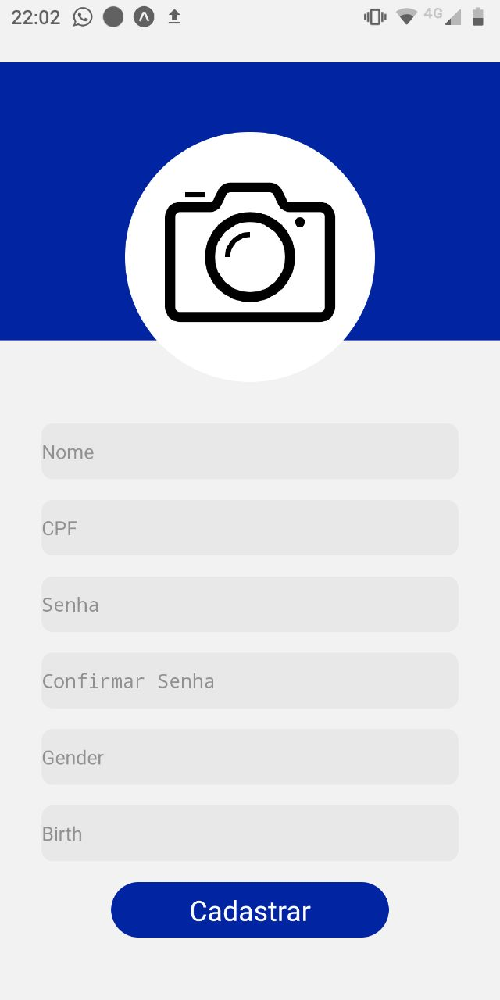

    

# Diário da Saúde

**Número do Grupo**: 05 
**Código da Disciplina**: FGA0208-T01 

## Alunos
|Matrícula | Aluno |
| -- | -- |
| 16/0112028  |  André Goretti |
| 17/0103471  | Gabriel Marques Tiveron |
| 16/0007780  | Gustavo Barbosa Carvalho |
| 16/0124778 | Ian Pereira de Sousa Rocha |
| 17/0163571 | Murilo Loiola Dantas |
| 15/0064535 | Rodrigo Dadamos Lopes da Silva |

## Sobre 
O **Diário da Saúde** é uma aplicação que busca auxiliar Unidades Básicas de Saúde (UBS) que possuam grupos de risco (diabéticos, hipertensos, etc). A aplicação permite que os profissionais da unidade possam acompanhar a condição do paciente à distância, através de medições realizadas de casa pelo próprio paciente.

## Screenshots

Segue abaixo 3 exemplos de telas da aplicação desenvolvida. 

### Tela inicial

### Tela de cadastro

### Tela de listagem dos grupos

### Tela do questinário de pressão arterial

## Instalação 
**Linguagens**: xxxxxx 
**Tecnologias**: xxxxxx 
Descreva os pré-requisitos para rodar o seu projeto e os comandos necessários.
Insira um manual ou um script para auxiliar ainda mais.

## Uso 
Explique como usar seu projeto caso haja algum passo a passo após o comando de execução.

## Vídeo
Adicione 1 ou mais vídeos com a execução do projeto final.

## Outros 
Quaisquer outras informações sobre seu projeto podem ser descritas abaixo.
