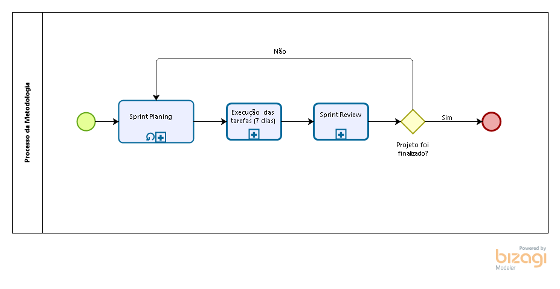
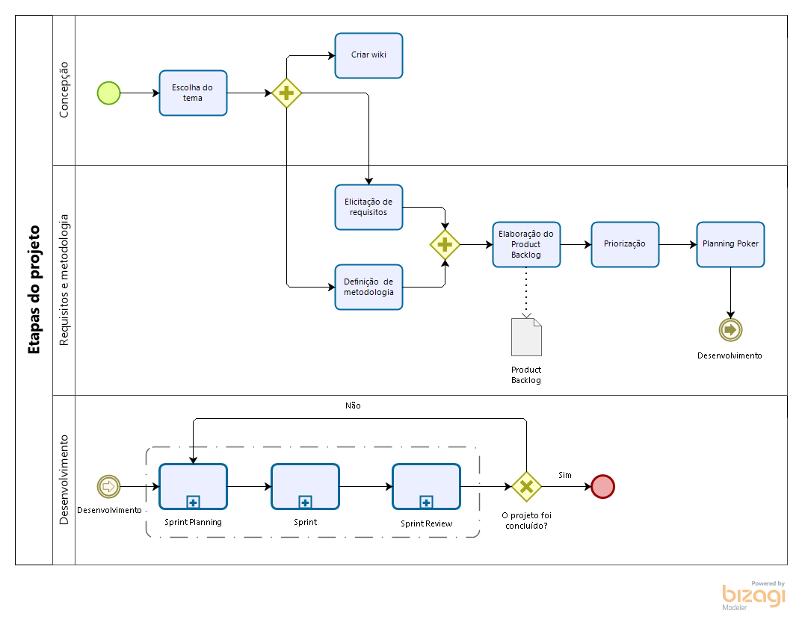
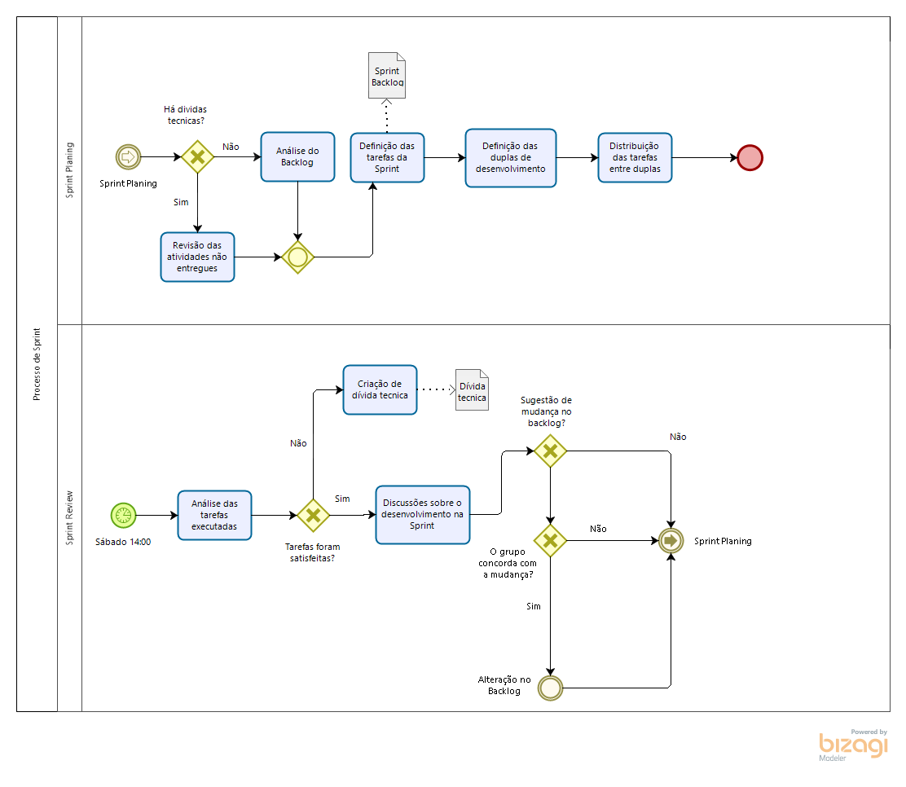

# Diagramas BPMN
|Data|Versão|Descrição|Autor(es)|
|:-:|:-:|:-:|:-:|
|11/09/2020|0.1|Criação do documento|[Gabriel Tiveron](https://github.com/GabrielTiveron)|
|11/09/2020|0.2|Adicionando introdução|[Murilo Loiola](https://github.com/murilo-dan)|
|11/09/2020|0.3|Adicionando segunda versão dos BPMN|[Murilo Loiola](https://github.com/murilo-dan)|
|11/09/2020|0.4|Adicionando áudio explicativo da metodologia|[Murilo Loiola](https://github.com/murilo-dan)|

## Introdução

&emsp;&emsp;O BPMN (Business Process Model and Notation) é um padrão que utiliza uma representação gráfica para especificação de processos de negócio. Esta ferramenta foi desenvolvida para fornecer uma notação padrão facilmente compreendida para todos os envolvidos. Neste projeto, o BPMN será utilizado para detalhar a metodologia que será utilizada durante o desenvolvimento.

### Explicação em áudio da metodologia

    <audio controls="controls">
        <source src="../audio_metodologia.ogg" type="audio/ogg" />
    </audio>

## Diagrama de Metodologia

#### Versão 0.1

#### Versão 0.2

## Diagrama da Sprint

#### Versão 0.1

#### Versão 0.2

