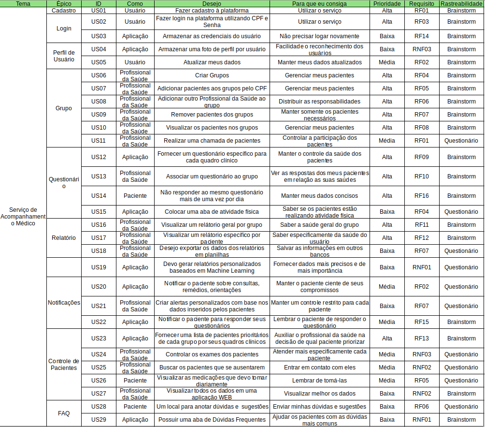

# Backlog do Produto

## Versionamento
| Data | Versão | Descrição | Autor |
| ----- | -------| -----------| -----|
| 03/09/2020 | 0.1 | Criação do Backlog do Produto | [Ian Rocha](https://github.com/IanPSRocha) |

## Introdução

&emsp;&emsp;Em termos gerais, o Product Backlog é uma listagem de todos os afazeres pendentes no projeto. Ele substitui o modelo tradicional de especificação de artefatos. Cada elemento da listagem é elicitado por meio de interação da equipe de desenvolvimento com o cliente, podendo ser apenas um representante, o que torna os elementos levantados muito arbitrários; ou podendo ser uma equipe representante do cliente, representando as diversas áreas que utilizarão o produto.

## Backlog

