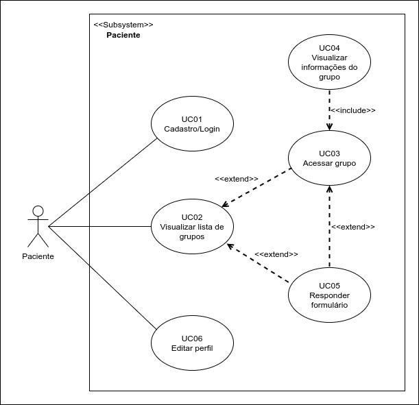

# Documento de Arquitetura de Software

## Versionamento
| Data | Versão | Descrição | Autor(es) |
|:----:|:------:|:---------:|:---------:|
| 14/11/2020 | 0.1 | Criação do Documento | [Murilo Loiola](https://github.com/murilo-dan) |
| 16/11/2020 | 0.2 | Adição do tópico de Introdução | [Murilo Loiola](https://github.com/murilo-dan) |
| 16/11/2020 | 0.3 | Adição do tópico de Escopo | [Murilo Loiola](https://github.com/murilo-dan) |
| 17/11/2020 | 0.4 | Adição do tópico de Visão Geral na Introdução | [Murilo Loiola](https://github.com/murilo-dan) |
| 18/11/2020 | 0.5 | Adição do tópico de Tecnologias | [Murilo Loiola](https://github.com/murilo-dan) |
| 18/11/2020 | 0.6 | Adição do tópico de Metas e Restrições Arquiteturais | [Murilo Loiola](https://github.com/murilo-dan) |

## Introdução

### Finalidade

&emsp;&emsp;Este documento fornece uma visão arquitetural abrangente do sistema, utilizando-se de um número de diferentes visões arquiteturais para descrever diferentes aspectos do sistema. Seu propósito é capturar e transmitir as decisões arquiteturais mais importantes que foram tomadas em relação ao sistema.

### Escopo

&emsp;&emsp;Este Documento de Arquitetura de Software fornece uma visão arquitetural abrangente do sistema Diário da Saúde. O sistema em questão está sendo desenvolvido por alunos da UnB-FGA com o intuito de facilitar a comunicação entre paciente e profissional da saúde em grupos de acompanhamento de Unidades Básicas de Saúde (UBS).

### Referências

### Visão Geral

&emsp;&emsp;Este documento busca informar de maneira compreensiva a arquitetura geral, bem como prover links para especificações mais detalhadas, do aplicativo <strong>Diário da Saúde</strong>. O documento traz, primeiramente, uma visão geral do sistema no tópico de Representação Arquitetural, demonstrando uma relação de macro nível entre os módulos do sistema, onde também são descritas as tecnologias utilizadas. Em seguida, há o tópico de Metas e Restrições da Arquitetura, descrevendo os requisitos e objetivos que geram impacto significativo na arquitetura. Logo após, são descritas as visões pertinentes para a compreensão da arquitetura, sendo elas: Visão de Casos de Uso, Visão Lógica. Por último, os tópicos de Tamanho e Performance e Qualidade.

## Representação Arquitetural

&emsp;&emsp;Este documento apresenta a arquitetura como uma série de visões: Visão de Casos de Uso, Visão Lógica. Essas visões são descritas e detalhadas através de diagramas UML (<i>Unified Modeling Language</i>) acompanhados de descrições curtas.

### Visão Geral

*Inserir diagrama representando macro níveis do sistema.*

### Tecnologias

#### Front-End

* 
<strong>Node.js</strong>: é um ambiente de execução JavaScript <i>server-side</i>, sem dependência com navegadores web. Sua utilização apresenta vantagens como alto fator de escalabilidade, taxa de transferência e flexibilidade

#### Back-End

* 
<strong>React Native</strong>: é um <i>framework</i> JavaScript para aplicações <i>mobile</i> desenvolvido pelo Facebook. Ele é utilizado para desenvolver aplicações móveis de forma nativa, permitindo aos desenvolvedores levar a aplicação para sistemas Android e iOS simultaneamente.

#### Banco de Dados

* 
<strong>MongoDB</strong>: é uma ferramenta de banco de dados não relacional. Utiliza documentos semelhantes ao JSON par organizar os dados, oferecendo alta variedade e flexibilidade.

#### Outros

* 
<strong>Docker</strong>: é uma ferramenta que utiliza virtualização de SO para entregar software em pacotes chamados contêineres. Os contêineres são isolados uns dos outros e possuem seus prórpios softwares, bibliotecas e arquivos de configuração. Está sendo utilizado tanto no back-end quanto no front-end, com o objetivo de facilitar o desenvolvimento em grupo.

## Metas e Restrições Arquiteturais

### Restrições

* É necessário ter conexão com a Internet para utilizar o aplicativo;
* A aplicação oferecerá suporte para Android e iOS;
* O escopo proposto deve ser terminado até a data estipulada para entrega;
* O software deve ser desenvolvido utilizando as tecnologias mencionadas anteriormente;

### Metas

* **Usabilidade**: o software deve ser de fácil utilização, com foco em aprendibilidade e simplicidade, buscando atender ao público (maioria de idade avançada) para o qual o software está sendo desenvolvido;
* **Segurança**: o software deve garantir a segurança dos dados dos usuários.
* **Manutenibilidade**: o software deve ser de fácil modificação posterior a finalização do trabalho, facilitando continuação;

## Visão de Casos de Uso

&emsp;&emsp;Neste tópico há uma descrição da visualização dos casos de uso da arquitetura de software. Aqui são descritos cenários e/ou casos de uso que representam uma funcionalidade significativa para o sistema. &emsp;&emsp;Os casos de uso deste sistema estão listados abaixo. Aqueles destacados em <strong>negrito</strong> possuem impacto significativo na arquitetura e são descritos posteriormente neste mesmo tópico.

* **UC01 - Cadastro/Login**
* **UC02 - Visualizar lista de grupos**
* **UC03 - Acessar grupo**
* UC04 - Visualizar informações do grupo
* **UC05 - Responder formulário**
* UC06 - Editar perfil

Figura 1: diagrama dos casos de uso para o autor "paciente"

## Visão Lógica

### Visão Geral

&emsp;&emsp;

## Tamanho e Performance

## Qualidade