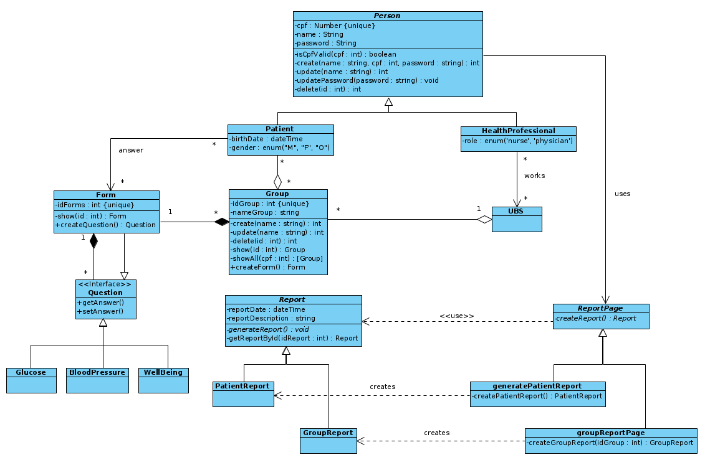
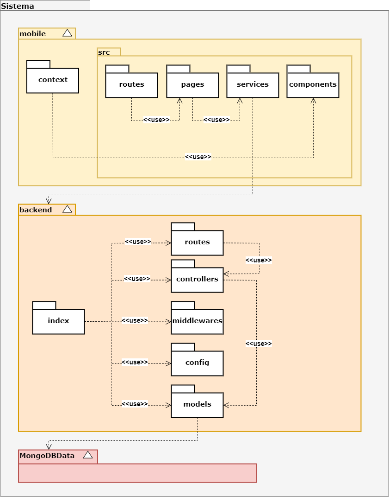
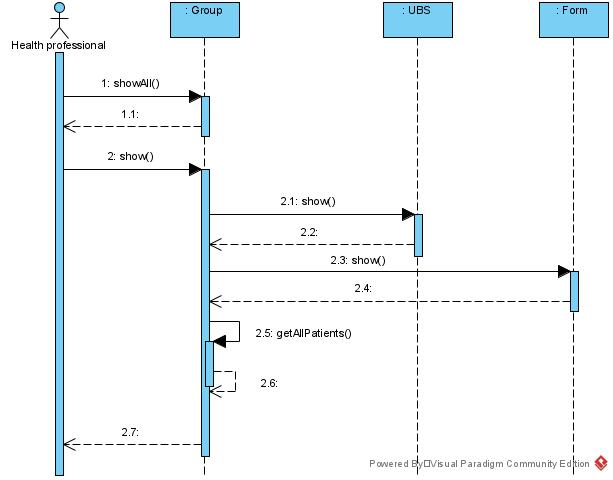
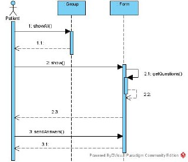
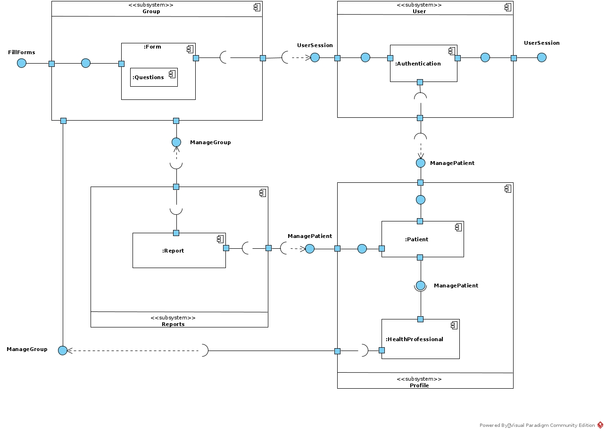
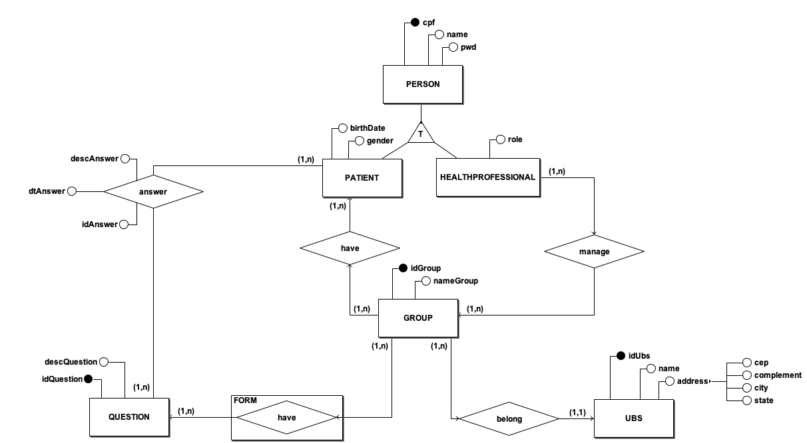

# Documento de Arquitetura de Software

## Versionamento
| Data | Versão | Descrição | Autor(es) |
|:----:|:------:|:---------:|:---------:|
| 14/11/2020 | 0.1 | Criação do documento e adição do tópico de Introdução  | [Murilo Loiola](https://github.com/murilo-dan) |
| 17/11/2020 | 0.2 | Adição do tópico de Visão Geral na Introdução e Adição do tópico de Escopo | [Murilo Loiola](https://github.com/murilo-dan) |
| 18/11/2020 | 0.3 | Adição do tópico de Tecnologias | [André Goretti](https://github.com/AGoretti) |
| 18/11/2020 | 0.4 | Adição do tópico de Metas e Restrições Arquiteturais | [Murilo Loiola](https://github.com/murilo-dan) |
| 18/11/2020 | 0.5 | Adição do tópico de Visão Lógica, Visão de Dados, Visão de Casos de Uso | [Murilo Loiola](https://github.com/murilo-dan), [Gabriel Tiveron](https://github.com/GabrielTiveron), [André Goretti](https://github.com/AGoretti) |
| 19/11/2020 | 0.6 | Correção no tópico de tecnologias | [Gabriel Tiveron](https://github.com/GabrielTiveron) |
| 19/11/2020 | 0.7 | Adição do diagrama de arquitetura geral| [Gustavo Carvalho](https://github.com/gustavocarvalho1002) |
| 19/11/2020 | 0.8 | Adição do diagrama de pacotes geral| [Gustavo Carvalho](https://github.com/gustavocarvalho1002), [Murilo Loiola](https://github.com/murilo-dan) |
| 19/11/2020 | 0.9 | Adição do tópico de Visão de Processos | [Murilo Loiola](https://github.com/murilo-dan) |
| 19/11/2020 | 0.10 | Adição da descrição do diagrama de pacotes e descrição dos processos | [Gustavo Carvalho](https://github.com/gustavocarvalho1002), [Murilo Loiola](https://github.com/murilo-dan) |
| 20/11/2020 | 0.11 | Adição de acrônimos e abreviações | [Rodrigo Dadamos](https://github.com/Rdadamos) |
| 20/11/2020 | 0.12 | Adição de diagrama de classes focado nas mais relevantes | [Rodrigo Dadamos](https://github.com/Rdadamos) |
| 20/11/2020 | 0.13 | Adição de diagrama de comunicação e da Visão de Implementação | [Rodrigo Dadamos](https://github.com/Rdadamos) |

## Introdução

### Finalidade

&emsp;&emsp;Este documento fornece uma visão arquitetural abrangente do sistema, utilizando-se de um número de diferentes visões arquiteturais para descrever diferentes aspectos do sistema. Seu propósito é capturar e transmitir as decisões arquiteturais mais importantes que foram tomadas em relação ao sistema.

### Escopo

&emsp;&emsp;Este Documento de Arquitetura de Software fornece uma visão arquitetural abrangente do sistema Diário da Saúde. O sistema em questão está sendo desenvolvido por alunos da UnB-FGA com o intuito de facilitar a comunicação entre paciente e profissional da saúde em grupos de acompanhamento de UBS.

### Acrônimos e Abreviações

* **UnB**: Universidade de Brasília
* **FGA**: Faculdade UnB Gama
* **UBS**: Unidades Básicas de Saúde
* **UML**: Unified Modeling Language (Linguagem de Modelagem Unificada)

### Referências

### Visão Geral

&emsp;&emsp;Este documento busca informar de maneira compreensiva a arquitetura geral, bem como prover links para especificações mais detalhadas, do aplicativo <strong>Diário da Saúde</strong>. O documento traz, primeiramente, uma visão geral do sistema no tópico de Representação Arquitetural, demonstrando uma relação de macro nível entre os módulos do sistema, onde também são descritas as tecnologias utilizadas. Em seguida, há o tópico de Metas e Restrições da Arquitetura, descrevendo os requisitos e objetivos que geram impacto significativo na arquitetura. Logo após, são descritas as visões pertinentes para a compreensão da arquitetura, sendo elas: Visão de Casos de Uso, Visão Lógica, Visão de Processos e Visão de Dados. Por último, os tópicos de Tamanho e Performance e Qualidade.

## Representação Arquitetural

&emsp;&emsp;Este documento apresenta a arquitetura como uma série de visões: Visão de Casos de Uso, Visão Lógica. Essas visões são descritas e detalhadas através de diagramas UML acompanhados de descrições curtas.

### Visão Geral

### Tecnologias

#### Back-End

* 
<strong>Node.js</strong>: é um ambiente de execução JavaScript <i>server-side</i>, sem dependência com navegadores web. Sua utilização apresenta vantagens como alto fator de escalabilidade, taxa de transferência e flexibilidade.

#### Front-End

* 
<strong>React Native</strong>: é um <i>framework</i> JavaScript para aplicações <i>mobile</i> desenvolvido pelo Facebook. Ele é utilizado para desenvolver aplicações móveis de forma nativa, permitindo aos desenvolvedores levar a aplicação para sistemas Android e iOS simultaneamente.

#### Banco de Dados

* 
<strong>MongoDB</strong>: é uma ferramenta de banco de dados não relacional. Utiliza documentos semelhantes ao JSON par organizar os dados, oferecendo alta variedade e flexibilidade.

#### Outros

* 
<strong>Docker</strong>: é uma ferramenta que utiliza virtualização de SO para entregar software em pacotes chamados contêineres. Os contêineres são isolados uns dos outros e possuem seus prórpios softwares, bibliotecas e arquivos de configuração. Está sendo utilizado tanto no back-end quanto no front-end, com o objetivo de facilitar o desenvolvimento em grupo.

## Metas e Restrições Arquiteturais

### Restrições

* É necessário ter conexão com a Internet para utilizar o aplicativo;
* A aplicação oferecerá suporte para Android e iOS;
* O escopo proposto deve ser terminado até a data estipulada para entrega;
* O software deve ser desenvolvido utilizando as tecnologias mencionadas anteriormente;

### Metas

* **Usabilidade**: o software deve ser de fácil utilização, com foco em aprendibilidade e simplicidade, buscando atender ao público (maioria de idade avançada) para o qual o software está sendo desenvolvido;
* **Segurança**: o software deve garantir a segurança dos dados dos usuários.
* **Manutenibilidade**: o software deve ser de fácil modificação posterior a finalização do trabalho, facilitando continuação;

## Visão de Casos de Uso

&emsp;&emsp;Neste tópico há uma descrição da visualização dos casos de uso da arquitetura de software. Aqui são descritos cenários e/ou casos de uso que representam uma funcionalidade significativa para o sistema. &emsp;&emsp;Os casos de uso deste sistema estão listados abaixo. Aqueles destacados em <strong>negrito</strong> possuem impacto significativo na arquitetura e são descritos posteriormente neste mesmo tópico.

* **UC01 - Cadastro/Login**
* **UC02 - Visualizar lista de grupos**
* **UC03 - Acessar grupo**
* UC04 - Visualizar informações do grupo
* **UC05 - Responder formulário**
* UC06 - Editar perfil
* **UC07 - Gerenciar pacientes**
* UC08 - Adicionar pacientes
* UC09 - Excluir pacientes
* **UC10 - Gerar relatório**
* UC11 - Gerar relatório individual
* UC12 - Gerar relatório geral
* **UC13 - Criar grupo**
* **UC14 - Criar formulário**
* UC15 - Escolher perguntas

 

#### Casos de uso - Paciente

#### Casos de uso - Profissional da Saúde

#### Descrição dos casos de uso significativos

* 
UC01 - Cadastro/Login: este caso de uso ocorre quando o usuário realiza o cadastro ou login no sistema. Como há permanência de dados, o cadastro precisa ser realizado somente uma vez para cada usuário. É importante notar que o paciente e o profissional da saúde compartilham este caso de uso, sendo necessário a diferenciação (realizada pelo próprio usuário) para qual tipo de ator a conta se refere durante o cadastro.

* 
UC02 - Visualizar lista de grupos: este caso de uso ocorre assim que o usuário loga no aplicativo. A tela inicial apresenta a lista de grupos aos quais o usuário pertence (no caso de paciente) ou que o usuário possui (no caso de profissional da saúde).

* 
UC03 - Acessar grupo: este caso de uso é exclusivo para o ator profissional da saúde e ocorre quando o usuário seleciona algum grupo específico da lista de grupos. Serão apresentadas informações do grupo e diferentes ações a serem tomadas para gerenciamento dos membros.

* 
UC05 - Responder formulário: este caso de uso é exclusivo para o ator paciente e consiste em responder o formulário de determinado grupo. É importante notar que é possível responder o formulário tanto a partir da lista de grupos, quanto a partir da seleção de um grupo específico.

* 
UC07 - Gerenciar pacientes: este caso de uso é exclusivo para o ator profissional da saúde e consiste em gerenciar os pacientes de um grupo qualquer. É possível adicionar ou remover pacientes.

* 
UC10 - Gerar relatório: este caso de uso é exclusivo para o ator profissional da saúde e consiste em gerar um relatório dos dados obtidos a partir dos formulários. É possível gerar um relatório geral do grupo ou selecionar um paciente específico para obter um reltório individual.

* 
UC13 - Criar grupo: este caso de uso é exclusivo para o ator profissional da saúde e consiste em criar um novo grupo. Não é possível criar um grupo sem adicionar um formulário.

* 
UC14 - Criar formulário: este caso de uso é exclusivo para o ator profissional da saúde e consiste em criar o formulário de um grupo. O formulário é customizável a partir de uma gama de questões pré-existentes.

## Visão Lógica

&emsp;&emsp;Neste tópico há uma descrição das principais classes e pacotes que compõem o sistema. As descrições estão posicionadas logo após os diagramas de <a href="https://unbarqdsw.github.io/2020.1_G5_Diario_da_Saude/#diagrama_de_classes/">Classe</a> e <a href="https://unbarqdsw.github.io/2020.1_G5_Diario_da_Saude/#diagrama_de_pacotes/">Pacotes</a>.

#### Diagrama de Classes

&emsp;&emsp;O diagrama de classes sem métodos e atributos colapsados pode ser visto no <a href="https://unbarqdsw.github.io/2020.1_G5_Diario_da_Saude/img/class_diagram_gof_2.png"> diagrama de classe completo</a>.

#### Principais classes

* 
<i><strong>Person</i></strong>: a classe <i>Person</i> representa o usuário do sistema. Duas outras classes herdam dela, a classe <i>Patient</i> e a classe <i>HealthProfessional</i>. Essa estrutura de herança foi estabalecida devido a semelhança que as duas classes filhas possuem entre si, facilitando a modularização. Na classe pai estão descritos os atributos e métodos que ambas as classes filhas compartilham, enquanto em cada uma das classes filhas estão descritos os atributos e métodos exclusivos daquele tipo de usuário.

* 
<i><strong>Group</i></strong>: a classe <i>Group</i> representa os grupos. Os grupos são contituídos de vários usuários do tipo <i>Patient</i> e estão associados a um único <i>Form</i>.

* 
<i><strong>Form</i></strong>: a classe <i>Form</i> representa os formulários de perguntas de cada grupo.

* 
<i><strong>Question</i></strong>: a classe <i>Question</i> representa as perguntas existentes no sistema. Esta classe é uma interface, de forma que seu comportamento é definido de acordo com as classes filhas. As classes filhas são as perguntas registradas no sistema e que constituem um formulário.

* 
<i><strong>Report</i></strong>: a classe <i>Report</i> representa os relatórios individuais ou gerais.

#### Diagrama de Pacotes

* 
<strong>Camada <i>Mobile</i></strong>: a camada de frontend é composta pelos diretórios <i>Context, Routes, Pages, Services e Components</i>. O primeiro, respectivamente, é responsável por prover informações e contexto para toda a aplicação. O segundo tem como papel definir os caminhos de acesso do usuário às várias telas da aplicação. O diretório <i>Pages</i> guarda as telas da aplicação. O diretório <i>Services</i> contém os scripts com as regras de negócios e métodos como os de requisições HTTPs. Por último, a pasta <i>Components</i> guarda arquivos responsáveis por renderizar partes específicas, normalmente repetidas, das telas.

* 
<strong>Camada <i>Backend </i></strong>: a camada do backend é onde se encontra o projeto da API feita em <i>Node.Js</i> e <i>Express</i>. Ele segue uma estrutura MVC. A pasta <i>index</i> é o diretório que guarda o código iniciliazador da aplicação e é a partir dele que todos os outros códigos são inicializados. <i>Routes</i> é o diretório que guarda os arquivos de rotas da aplicação, por onde passam todas as requisições http feitas à API.
<i>Controllers</i> é a pasta que onde se encontram os arquivos de "ações", que são responsáveis por recuperar os dados do banco atráves das <i>models</i>. Os <i>scripts</i> de controller são utilizados dentro dos arquivos de <i>routes</i>.

* 
<strong>Camada Mongo</strong>: A camada do Mongo é onde ficam os arquivos de configuração do banco de dados MongoDB.

#### Diagrama de comunicação

&emsp;&emsp;Uma importante interação entre objetos é a interação entre <i>Profissional de Saúde</i> e o <i>Grupo</i>:

## Visão de Processos

&emsp;&emsp;Neste tópico há uma descrição dos principais processos que ocorrem durante a utilização do sistema. Para acompanhar a descrição dos principais processos, seguem os <a href="https://unbarqdsw.github.io/2020.1_G5_Diario_da_Saude/#diagrama_de_sequencia/">Diagramas de Sequência</a> pertinentes.

#### Diagramas de Sequência

#### Principais processos

* 
<i><strong>showAll</i>()</strong>: processo responsável por retornar conjuntos de informações, a depender do argumento fornecido (sobrecarga). É muito utilizado durante todo a execução do aplicativo, principalmente para apresentar todos os grupos ao qual o usuário está atrelado.

* 
<i><strong>getAllPatients</i>()</strong>: processo responsável por retornar lista de pacientes pertecentes a um grupo. Muito utilizado pelo usuário profissional da saúde para gerenciar os membros de um grupo.

* 
<i><strong>getQuestions</i>()</strong>: utilizado durante a criação e o acesso a formulários, retorna as questões que um determinado formulário possui.

* 
<i><strong>sendAnswers</i>()</strong>: processo essencial para a principal função da aplicação: manter contato entre paciente e profissional da saúde. Este processo recebe e salva as respostas de cada paciente para que o profissional da saúde possa realizar uma avaliação posteriormente.

## Visão de Implantação

#### Diagrama de Implantação

## Visão de Implementação

&emsp;&emsp;Após a autenticação, pacientes podem responder as questões dos formulários dos grupos aos quais pertencem e podem gerar relatórios individuais. Profissionais de saúde, após a autenticação, podem gerenciar grupos e gerar relatórios individuias e gerais. Uma representação de como esses importantes componentes do sistema são conectados pode ser vista no <a href="https://unbarqdsw.github.io/2020.1_G5_Diario_da_Saude/#diagrama_de_componente/">diagramas de componentes</a>.

#### Diagrama de Componentes

## Visão de Dados

&emsp;&emsp;Neste tópico há uma descrição do modelo de persistência de dados utilizado no sistema. Para a descrição do comportamento das entidades do sistema, utilizou-se o <a href="https://unbarqdsw.github.io/2020.1_G5_Diario_da_Saude/#der/">DE-R</a>. Para definir as regras de negócio entre cada tabela armazenada no banco de dados, utilizou-se o <a href="https://unbarqdsw.github.io/2020.1_G5_Diario_da_Saude/#dl/">Diagrama Lógico</a>.

#### DE-R

#### Diagrama Lógico

## Tamanho e Performance

## Qualidade

* 
Usabilidade: a interface, conforme descrito anteriormente, segue uma estilização simples e intuitiva, utilizando fontes e cores adequadas. Estas definições podem ser visualizadas no documento de <a href="https://unbarqdsw.github.io/2020.1_G5_Diario_da_Saude/#identidade_visual/">Identidade Visual</a>.

* 
Segurança: cada sessão do usuário recebe um token temporário, utilizado para realizar a autenticação do usuário e resgatar dados privados do banco.

* 
Manutenibilidade: todo o desenvolvimento do projeto foi documentado no repositório do grupo: <a href="https://github.com/UnBArqDsw/2020.1_G5_Diario_da_Saude">Diário da Saúde</a>. O fácil acesso a documentação facilita na compreensão e apoia a manutenibilidade do código.

