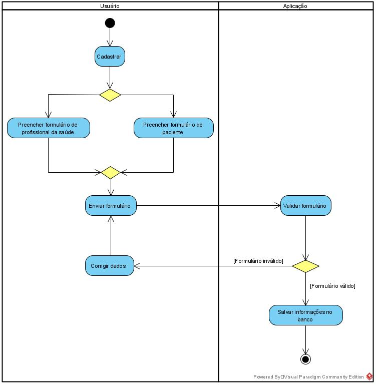
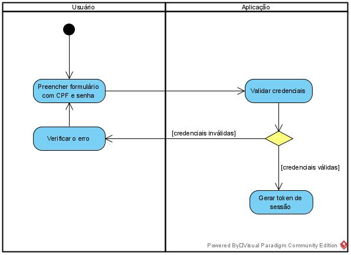
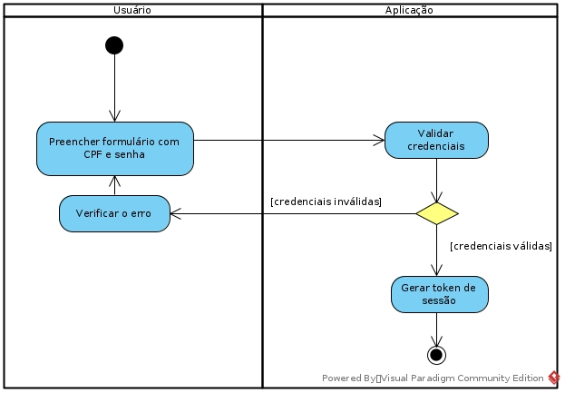
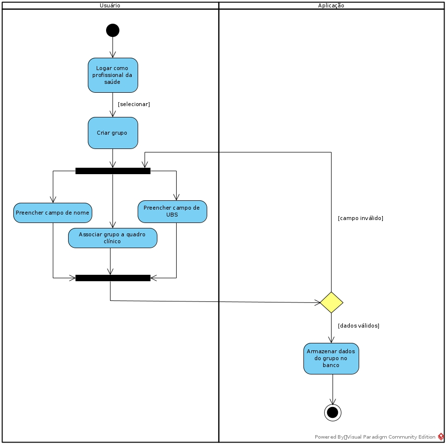
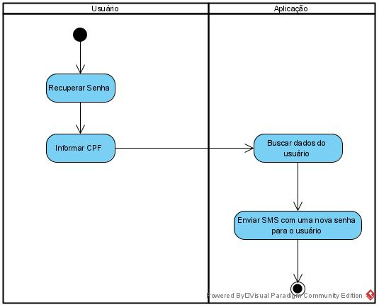

# Diagrama de atividade
## Versionamento
| Data | Versão | Descrição | Autor(es) |
|:----:|:------:|:---------:|:---------:|
| 23/09/2020 | 0.1 | Criação do Documento | [Gustavo Carvalho](https://github.com/gustavocarvalho1002) |
| 23/09/2020 | 0.2 | Adição do diagrama de cadastro | [Gustavo Carvalho](https://github.com/gustavocarvalho1002), [Gabriel Tiveron](https://github.com/GabrielTiveron), [Rodrigo Dadamos](https://github.com/Rdadamos), [Murilo Loiola](https://github.com/murilo-dan) |
| 23/09/2020 | 0.3 | Adição do diagrama de login e diagrama de recuperação de senha | [Gustavo Carvalho](https://github.com/gustavocarvalho1002) |
| 23/09/2020 | 0.4 | Adição do diagrama de relatório | [Gabriel Tiveron](https://github.com/GabrielTiveron) |
| 23/09/2020 | 0.5 | Adição do diagrama de criação de grupo | [Murilo Loiola](https://github.com/murilo-dan) |
| 23/09/2020 | 0.6 | Adição da segunda versão do diagrama de login | [Murilo Loiola](https://github.com/murilo-dan) |

## Definição

&emsp;&emsp;Os diagramas de atividades são representações gráficas de fluxos de trabalho de atividades e ações com suporte para escolha, iteração e simultaneidade. No UML, os diagramas de atividades têm como objetivo modelar os processos computacionais e organizacionais (ou seja, fluxos de trabalho), bem como os fluxos de dados que se cruzam com as atividades relacionadas.

## Diagrama de atividade
### Cadastrar usuário
##### *versão 0.1*

### Login 
##### *versão 0.1*

##### *versão 0.2*

### Criar grupo 
##### *versão 0.1*

### Adicionar pessoas grupo 
##### *versão 0.1*
### Responder questionário 
##### *versão 0.1*
### Relatório geral por grupo
##### *versão 0.1*

### Recuperar Senha
##### *versão 0.1*

## Referências

1. Documentação de diagramas UML, Diagrama de Atividades. Disponível em: [uml-diagrams.org](https://www.uml-diagrams.org/activity-diagrams.html). Acesso em: 23/09/2020.
