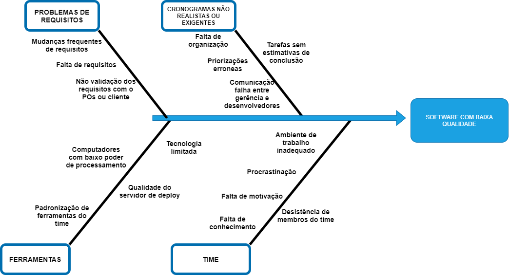

# Diagrama de causa e efeito
## Versionamento
| Data | Versão | Descrição | Autor(es) |
|:----:|:------:|:---------:|:---------:|
| 06/09/2020 | 0.1 | Criação do Documento | [Gustavo Carvalho](https://github.com/gustavocarvalho1002) |
| 08/09/2020 | 0.2 | Padronização do documento e adicionando caminho no índice | [Murilo Loiola](https://github.com/murilo-dan) |

## Definição

&emsp;&emsp;Diagramas de causa e efeito (ou diagrama de Ishikawa) são diagramas causais que mostram as causas potenciais de um evento específico. Seu uso é muito comum para a prevenção de defeitos de qualidade e para identificar fatores potenciais que contribuam para um efeito geral. Cada causa ou motivo de imperfeição é uma fonte de variação. As causas geralmente são agrupadas em categorias principais para identificar e classificar essas fontes de variação.

## Diagrama de causa e efeito
#### **Defeitos no software**

#### **Software de baixa qualidade**

