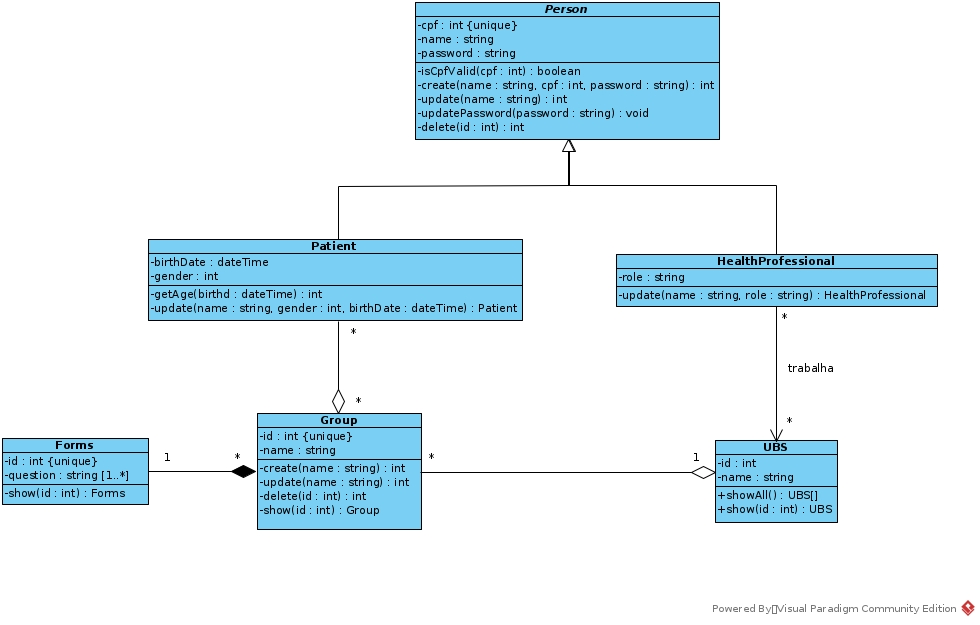
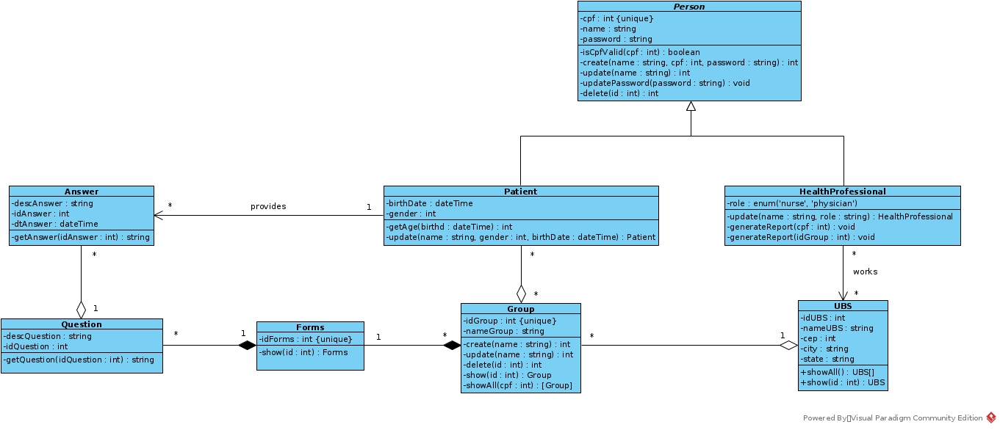

# Diagrama de classes
## Versionamento
| Data | Versão | Descrição | Autor(es) |
|:----:|:------:|:---------:|:---------:|
| 23/09/2020 | 0.1 | Criação do Documento | [Gustavo Carvalho](https://github.com/gustavocarvalho1002) |
| 23/09/2020 | 0.2 | Adição da primeira versão do diagrama de classes | [André Goretti](https://github.com/AGoretti), [Gabriel Tiveron](https://github.com/GabrielTiveron), [Gustavo Carvalho](https://github.com/gustavocarvalho1002), [Ian Rocha](https://github.com/IanPSRocha), [Murilo Loiola](https://github.com/murilo-dan), [Rodrigo Dadamos](https://github.com/Rdadamos) |
| 28/09/2020 | 0.3 | Adição da segunda versão do diagrama de classes | [André Goretti](https://github.com/AGoretti), [Gabriel Tiveron](https://github.com/GabrielTiveron), [Murilo Loiola](https://github.com/murilo-dan), [Rodrigo Dadamos](https://github.com/Rdadamos) |

## Definição

&emsp;&emsp;O diagrama de classes no UML (Unified Modeling Language) é um tipo de diagrama de estrutura estática que descreve a estrutura de um sistema, mostrando as classes do sistema, seus atributos, métodos e os relacionamentos entre os objetos.

## Diagrama de classes
##### *versão 0.1*

##### *versão 0.2*

## Referências

1. Documentação de diagramas UML, Diagrama de Classes. Disponível em: [uml-diagrams.org](https://www.uml-diagrams.org/class-diagrams-overview.html). Acesso em: 23/09/2020.
