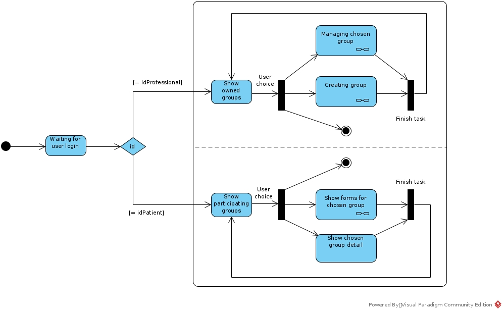
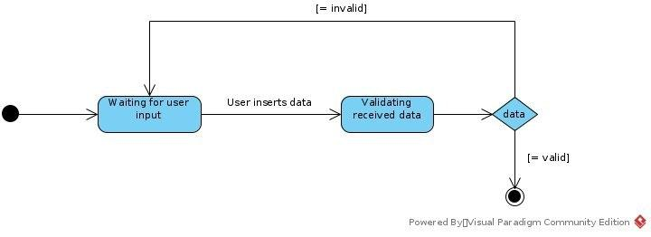
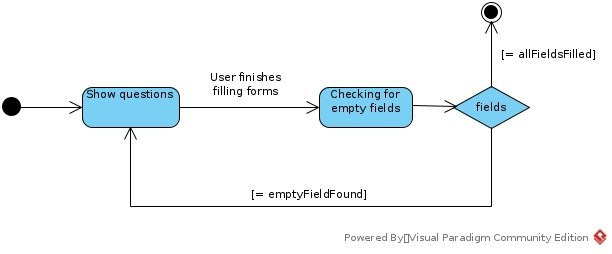

# Diagrama de estado
## Versionamento
| Data | Versão | Descrição | Autor(es) |
|:----:|:------:|:---------:|:---------:|
| 23/09/2020 | 0.1 | Criação do Documento | [Gustavo Carvalho](https://github.com/gustavocarvalho1002) |
| 26/09/2020 | 0.2 | Adição do diagrama de estados geral | [Murilo Loiola](https://github.com/murilo-dan) |
| 26/09/2020 | 0.3 | Adição do diagrama de estados mostrar grupo | [Gabriel Tiveron](https://github.com/GabrielTiveron) |
| 27/09/2020 | 0.4 | Adição do diagrama de estados criar grupo | [Ian Rocha](https://github.com/IanPSRocha) |
| 27/09/2020 | 0.5 | Adição do diagrama de estados questionário | [André Goretti](https://github.com/Agoretti) |

## Definição

&emsp;&emsp;Um diagrama de estado é usado para representar a condição do sistema ou parte do sistema em instâncias finitas de tempo. É um diagrama comportamental e representa o comportamento usando transições de estado finito.

## Diagrama de estado
### Geral
#### versão 0.1

### Mostrar membros do grupo
#### versão 0.1

### Criar grupo
#### versão 0.1

### Responder questionário
#### Versão 0.1

## Referências

1. Documentação de diagramas UML, Diagrama de Estados. Disponível em: [uml-diagrams.org](https://www.uml-diagrams.org/state-machine-diagrams.html). Acesso em: 23/09/2020.