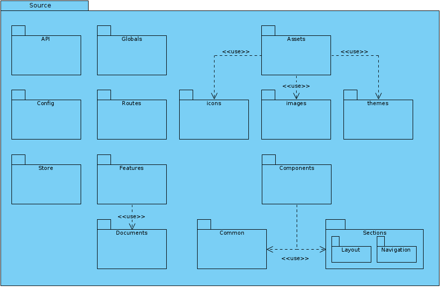
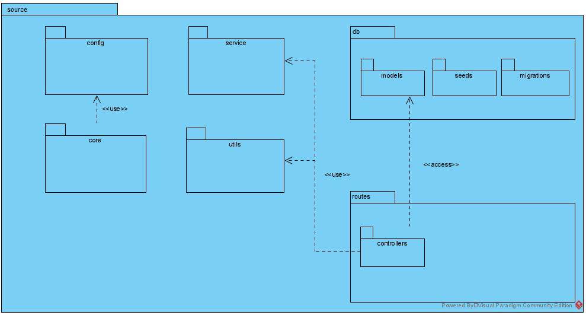

# Diagrama de pacotes
## Versionamento
| Data | Versão | Descrição | Autor(es) |
|:----:|:------:|:---------:|:---------:|
| 23/09/2020 | 0.1 | Criação do Documento | [Gustavo Carvalho](https://github.com/gustavocarvalho1002) |
| 28/09/2020 | 0.2 | Adição do Diagrama do FrontEnd | [Ian Rocha](https://github.com/IanPSRocha) |
| 28/09/2020 | 0.3 | Adição do diagrama do backend | [Gustavo Carvalho](https://github.com/gustavocarvalho1002) |

## Definição

&emsp;&emsp;Os diagramas de pacote são diagramas estruturais usados ​​para mostrar a organização e a disposição de vários elementos do modelo na forma de pacotes. Um pacote é um agrupamento de elementos UML relacionados, como diagramas, documentos, classes ou até mesmo outros pacotes.

## Diagrama do FrontEnd

##### *versão 0.1*

## Diagrama do BackEnd

##### *versão 0.1*

