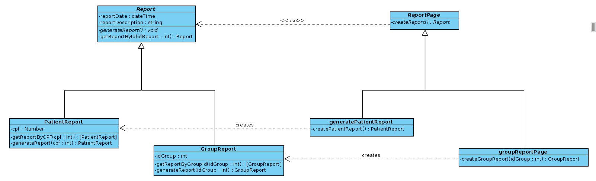

# GOF's Criacionais
## Versionamento
| Data | Versão | Descrição | Autor(es) |
|:----:|:------:|:---------:|:---------:|
| 22/10/2020 | 0.1 | Criação do Documento | [Murilo Loiola](https://github.com/murilo-dan) |
| 25/10/2020 | 0.2 | Adição da Introdução | [Rodrigo Dadamos](https://github.com/Rdadamos)|
| 26/10/2020 | 0.3 | Adição do Factory Method com definição e motivação | [Rodrigo Dadamos](https://github.com/Rdadamos)|
| 26/10/2020 | 0.4 | Adição de Referências | [Rodrigo Dadamos](https://github.com/Rdadamos)|
| 26/10/2020 | 0.5 | Adição do tópico 'Aplicação'| [Gustavo Carvalho](https://github.com/gustavocarvalho1002)|
| 26/10/2020 | 0.6 | Adição dos trechos de código das classes de <i>Report</i>, <i>GroupReport</i> e <i>PatientReport</i>| [Gustavo Carvalho](https://github.com/gustavocarvalho1002)|
| 26/10/2020 | 0.7 | Adição dos trechos de código das classes de <i>GroupReportPage</i>, <i>PatientReportPage</i> e <i>ReportPage</i>| [Gustavo Carvalho](https://github.com/gustavocarvalho1002)|
| 26/10/2020 | 0.8 | Adição do diagrama de classes | [Rodrigo Dadamos](https://github.com/Rdadamos)|

## Introdução

<p align="justify">&emsp;&emsp;De acordo com GAMMA et al. no livro <i>Design Patterns: Elements of Reusable Object-Oriented Software</i>, padrões de projeto são soluções consolidadas para um problema recorrente no desenvolvimento e manutenção de softwares orientados a objeto. A proposta é utilizar uma solução padronizada, consolidada, validada e testada pela comunidade para um problema recorrente ao longo do desenvolvimento e manutenção do software. Considerando o princípio de encapsulamento, a complexidade de um sistema deve ser isolada quando possível. Em um sistema orientado a objeto, a criação de objetos não é uma tarefa fácil e lida com dois principais problemas: definir qual classe concreta deve criar o objeto, e definir como os objetos se relacionam com outros objetos do sistema. Dessa maneira, os GOF's criacionais apontam soluções padronizadas para esses problemas. Os principais GOF's criacionais são:</p>

* Factory Method;
* Abstract Factory;
* Builder;
* Prototype;
* Singleton;
* Multiton;
* Object Pool;

## Factory Method

#### Definição

<p align="justify">&emsp;&emsp;Quando instâncias de determinados objetos são muito requisitadas por outras classes de forma que a hierarquia de classes desses objetos (que já faz muitos cálculos, possuindo outras responsabilidades e ainda outras partes comportamentais) sofre muitas solicitações de criação de instâncias ficando sobrecarregada e gerando um gargalo, é indicado o uso de um padrão criacional. O padrão Factory Method é um padrão muito útil e muito recorrente que encapsula a hierarquia de classes escolhida para a criação de objetos permitindo delegar a instaciação de objetos para as classes filhas. O Factory Method delega a instaciação a uma outra hierarquia de classes, espelho da hierarquia de classes que está sendo o gargalo, mas dedicada somente a criação de instâncias. Dessa forma, a hierarquia de classes original fica livre para realizar suas outras responsabilidades. Como a intenção é minimizar o gargalo, testes devem ser feitos para verificar se o objetivo foi alcançado.</p>

#### Motivação

<p align="justify">&emsp;&emsp;O Diário da Saúde permite tanto aos pacientes quanto aos profissionais de saúde gerarem relatórios. Esses relatórios possuem informações sobre o paciente e as respostas aos formulários aplicados em seus grupos. Os pacientes podem gerar somente relatórios individuais sobre eles mesmos, e os profissionais de saúde podem gerar relatórios individuais de pacientes pertencentes aos seus grupos de acompanhamento ou um relatório geral sobre um determinado grupo que ele acompanha. Dessa forma, há uma hierarquia de classes para o Relatório responsável pela instanciação de objetos nas classes filhas relatório individual e relatório do grupo, além de outras responsabilidades necessaŕias para a criação do relatórios, como consultas e outras partes comportamentais. Essa hierarquia é constantemente acessada e requisitada para criação de mais de um tipo de relatório pelas classes do Paciente e do Profissional de Saúde representando um possível gargalo para o sistema. O Factory Method, ao criar um espelho dessa hierarquia, delega a instaciação dos relatórios para essa hierarquia espelho que é dedicada somente a criação de instâncias.</p>

#### Aplicação no projeto
<p align="justify">&emsp;&emsp;Levando em consideração a motivação descrita acima, o padrão foi aplicado com o desenvolvimento de quatro papeis dentro do código:  criador base, criador especializado, produto abstrato e produto concreto. Para o produto abstrato nos temos a classe <i>Report</i>, que define o objeto base para as suas generalizações. Já as classes <i>GroupReport</i> e <i>PatientReport</i> fazem o papel dos produtos concretos, tendo como base a classe <i>Report</i>. Para os criadores foram implementados as classes GrouReportPage e PatientReportPage, que atuam na construção de relatórios de pacientes e grupos, onde essas classes são especializadas e derivam do criador base.</p>

#### Diagrama
[](./img/factory-method.jpg)


#### Código

- Report (produto abstrato)
```javascript
const mongoose = require('mongoose');
const Schema = mongoose.Schema;

const ReportSchema = new Schema({
  reportDate: {type: Date, required: true},
  reportDescription: {type: String, required: true},
});


class ReportClass{

  static getReportById(_id, callback){
    return this.findOne({_id:_id}, (err, report) => {
      if(err) throw err;

      callback(err, report)
    });
  }
  
}

ReportSchema.loadClass(ReportClass)

const ReportModel = mongoose.model('report', ReportSchema)
  
module.exports = {ReportClass, ReportSchema, ReportModel}
```

- GroupReport (produto concreto)
```javascript
const mongoose = require('mongoose'),
  Schema = mongoose.Schema;
Report = require('./report.model.js')

var groupReportSchema = new Schema({
  groupId: [{ type: Schema.Types.ObjectId, ref: "group" }]
});

class GroupReport extends Report.ReportClass {

  static getPatientReportByGroupId(groupId, callback){
    return this.findOne({groupId:groupId}, (err, report) => {
      if(err) throw err;

      callback(err, report)
    });
  }

}

groupReportSchema.loadClass(GroupReport);

module.exports = Report.ReportModel.discriminator('groupReport', groupReportSchema);
```

- PatientReport (produto concreto)
```javascript
const mongoose = require('mongoose'),
  Schema = mongoose.Schema;
Report = require('./report.model.js')

var patientReportSchema = new Schema({
  cpf:{type: Number, required: true}
});

class PatientReport extends Report.ReportClass {

  static getPatientReportByCPF(cpf, callback){
    return this.findOne({cpf:cpf}, (err, report) => {
      if(err) throw err;

      callback(err, report)
    });
  }

}

patientReportSchema.loadClass(PatientReport);

module.exports = Report.ReportModel.discriminator('patientReport', patientReportSchema);
```
- PatientReportPage (Criador especializado)
```javascript
const PatientReport = require('../models/patientReport.model.js');
const ReportPage = require('./reportPage.js')

class PatientReportPage extends ReportPage{

    static createPatientReport(){
        var patientReport = PatientReport.getReportByDate(req.reportDate)
        return patientReport;
    }

}

module.exports = PatientReportPage;
```
- GroupReportPage (Criador especializado)
```javascript
const GroupReport = require('../models/groupReport.model.js');
const ReportPage = require('./reportPage.js')

class GroupReportPage extends ReportPage{

    static createPatientReport(cpf){
        var groupReport = GroupReport.getPatientReportByCPF(cpf)
        return groupReport;
    }

}

module.exports = GroupReportPage;
```
- ReportPage (Criador base)
```javascript
const Report = require('../models/report.model.js');

class ReportPage{

    static generateReport(){}

}

module.exports = PatientReportPage;
```

## Referência

1. Factory Method - dofactory. Disponível em: <a>https://www.dofactory.com/javascript/design-patterns/factory-method</a>. Acesso em: 25 Outubro 2020.
2. Factory Method Design Pattern - SourceMaking. Disponível em: <a>https://sourcemaking.com/design_patterns/factory_method</a>. Acesso em: 25 Outubro 2020.
