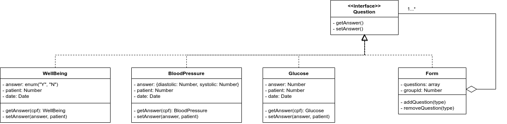

# GOF's Estruturais
## Versionamento
| Data | Versão | Descrição | Autor(es) |
|:----:|:------:|:---------:|:---------:|
| 22/10/2020 | 0.1 | Criação do Documento | [Murilo Loiola](https://github.com/murilo-dan) |
| 24/10/2020 | 0.2 | Adição do tópico Introdução | [Murilo Loiola](https://github.com/murilo-dan) |
| 24/10/2020 | 0.3 | Adição do tópico Composite | [Gabriel Tiveron](https://github.com/GabrielTiveron), [Murilo Loiola](https://github.com/murilo-dan) |
| 25/10/2020 | 0.4 | Adição do diagrama e hyperlinks no tópico Composite | [Gabriel Tiveron](https://github.com/GabrielTiveron), [Murilo Loiola](https://github.com/murilo-dan) |

## Introdução

&emsp;&emsp;Padrões de projeto estruturais se preocupam com a composição de objetos e normalmente identificam maneiras mais simples de estabelecer relacionamentos entre diferentes objetos. Estes padrões ajudam a garantir que, quando uma parte do sistema for alterada, o restanto do sistema também não precise fazer o mesmo. Em resumo, os padrões estruturais buscam reduzir o acoplamente entre objetos de um sistema orientado a objeetos. Os principais GOF's estruturais são:

* Adapter;
* Bridge;
* Composite;
* Decorator;
* Facade;
* Flyweight;
* Proxy;

&emsp;&emsp;A seguir, estão descritos somente os padrões aplicados no projeto, escolhidos pelo grupo quanto a contribuição que a aplicação do padrão traria para o desenvolvimento do projeto.

## Composite

#### Definição

&emsp;&emsp;O padrão Composite permite a criação de objetos com propriedades que são de itens primitivos ou de uma coleção de objetos. Cada item da coleção pode conter outras coleções, gerando estruturas profundamente aninhadas. Uma árvore é o exemplo perfeito de um padrão Composite. Os nós da árvore representam ou um único objeto (nós folha) ou um grupo de objeto (sub-árvores de nós).

#### Aplicação no projeto

&emsp;&emsp;Para o projeto, foi decidido aplicar o padrão Composite na relação Pergunta-Formulário. Nessa relação, os objetos Pergunta são considerados objetos individuais, enquanto o objeto Formulário é uma coleção de Perguntas. Dessa forma, essa estrutura encaixa-se perfeitamente no padrão Composite. Segue o diagrama representando a estrutura Composite Pergunta-Formulário e hyperlinks para os arquivos de código onde o padrão Composite foi implementado:

**Diagrama**

**Hyperlinks**

* [Interface - Question](https://github.com/UnBArqDsw/2020.1_G5_Diario_da_Saude/blob/master/backend/DiarioSaude/models/Question.model.js)
* [Leaf - BloodPressure](https://github.com/UnBArqDsw/2020.1_G5_Diario_da_Saude/blob/master/backend/DiarioSaude/models/TypeQuestion/BloodPressure.model.js)
* [Leaf - Glucose](https://github.com/UnBArqDsw/2020.1_G5_Diario_da_Saude/blob/master/backend/DiarioSaude/models/TypeQuestion/Glucose.model.js)
* [Leaf - WellBeing](https://github.com/UnBArqDsw/2020.1_G5_Diario_da_Saude/blob/master/backend/DiarioSaude/models/TypeQuestion/WellBeing.model.js)
* [Composite - Form](https://github.com/UnBArqDsw/2020.1_G5_Diario_da_Saude/blob/master/backend/DiarioSaude/models/Form.model.js)

#### Motivação

&emsp;&emsp;O padrão Composite foi aplicado na relação Pergunta-Formulário devido ao fato de que o Formulário é uma coleção de Perguntas. Essa estrutura nos permite dar ao Profissional da Saúde a capacidade de personalizar o Formulário com o conjunto de perguntas que ele julgar necessário para o grupo em questão, ao mesmo tempo que oferece a facilidade de tratar ambos os objetos de maneira uniforme.

## Referência

1. Craig, L. <b>Utilizando UML e Padrões</b>. Grupo A, 2011. 9788577800476. Disponível em: <a>https://integrada.minhabiblioteca.com.br/#/books/9788577800476/</a>. Acesso em: 22 Outubro 2020.
2. Composite pattern - Wikipedia. Disponível em: <a>https://en.wikipedia.org/wiki/Composite_pattern</a>. Acesso em: 24 Outubro 2020.
2. Composite pattern - dofactory. Disponível em: <a>https://www.dofactory.com/javascript/design-patterns/composite</a>. Acesso em: 24 Outubro 2020.