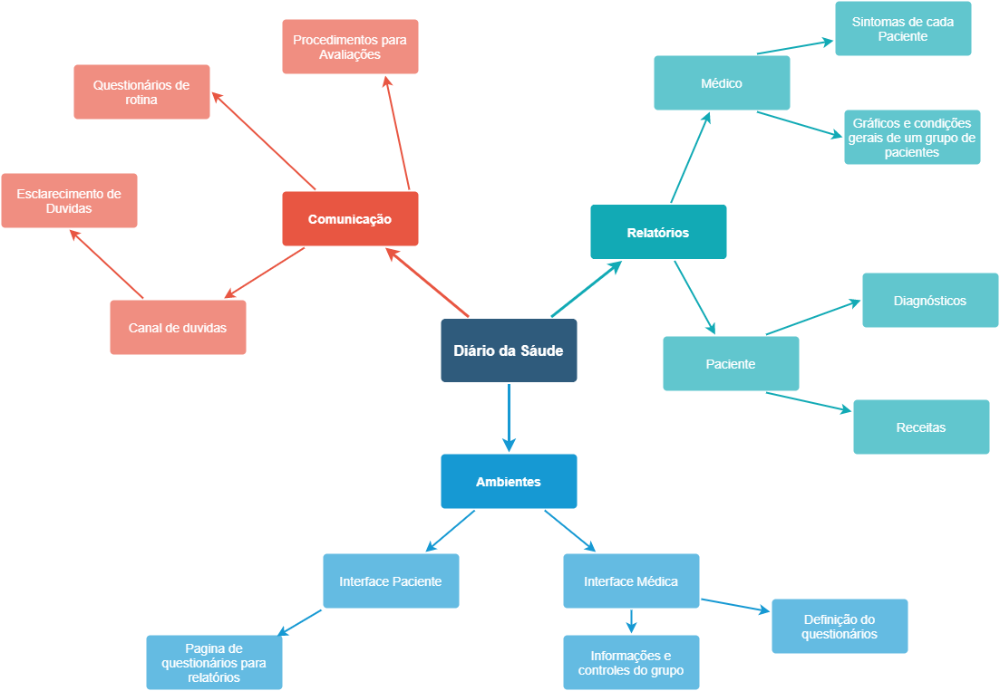

# Mapa Mental
## Versionamento
| Data | Versão | Descrição | Autor(es) |
|:----:|:------:|:---------:|:---------:|
| 04/09/2020 | 0.1 | Criação do Documento | [André Goretti](https://github.com/AGoretti) |
| 06/09/2020 | 0.2 | Correções de texto e formatação | [André Goretti](https://github.com/AGoretti) |

## Definição

&emsp;&emsp; Mapa mental é um processo simples e pessoal de fragmentar alguns conceitos dentro do seu projeto que detalham mais o escopo, podendo assim melhorar a analise e ter uma visão mais completa e palpável do projeto sabendo das relações de causa e efeito entres esse objetos. Alguns dos objetivos do mapa mentals são: 

- Memorização e aprendizado.
- Gestão de informações e conhecimento.
- Como uma ferramenta de brainstorm.
- Compreensão e soluções de problemas.
- Entender composições e similaridades do projeto.

## Mapas Mentais
### Mapa mental Aplicativo

