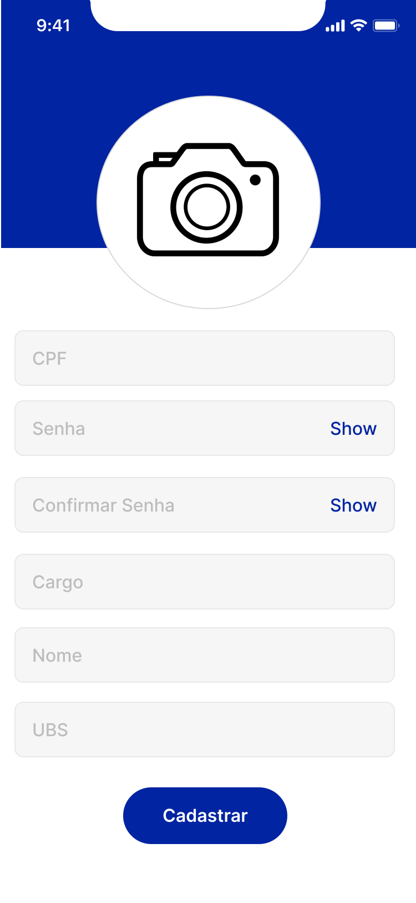
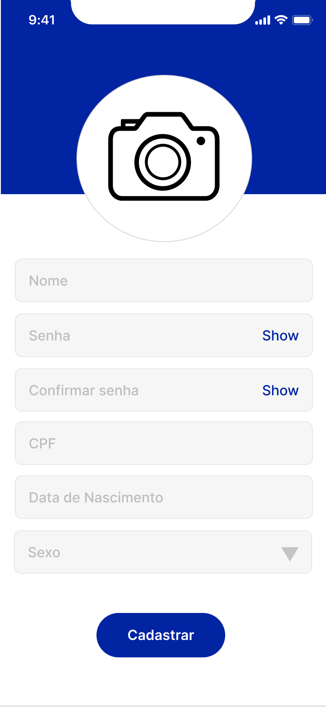
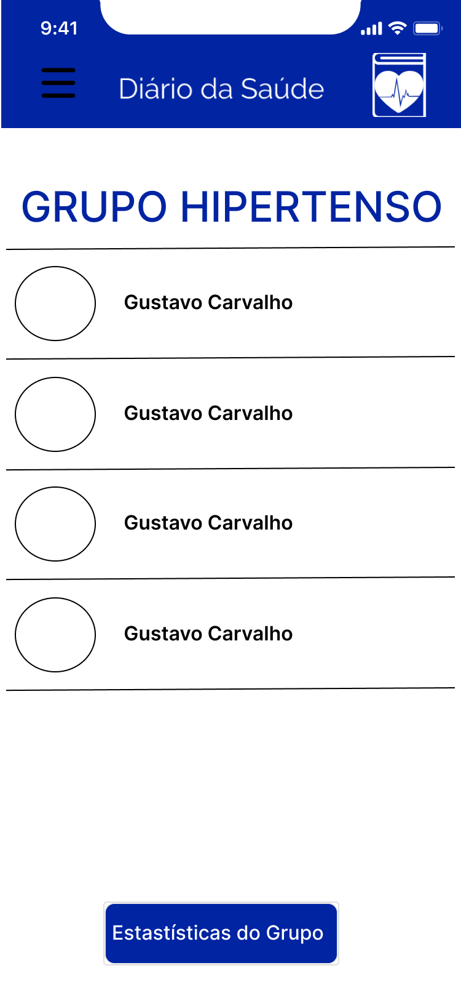
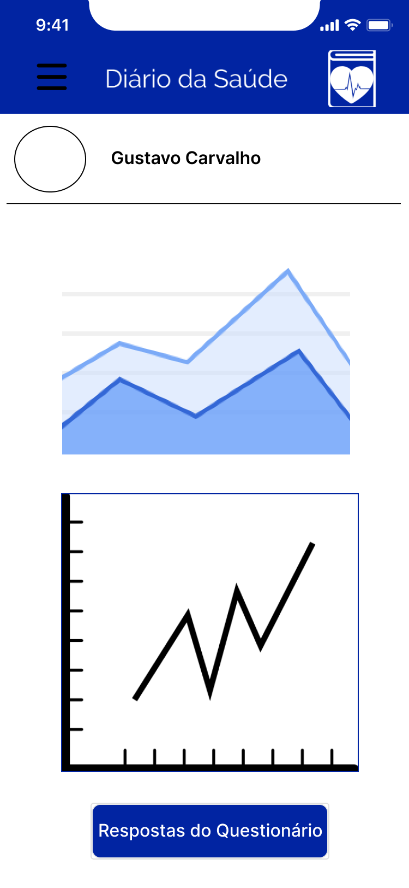
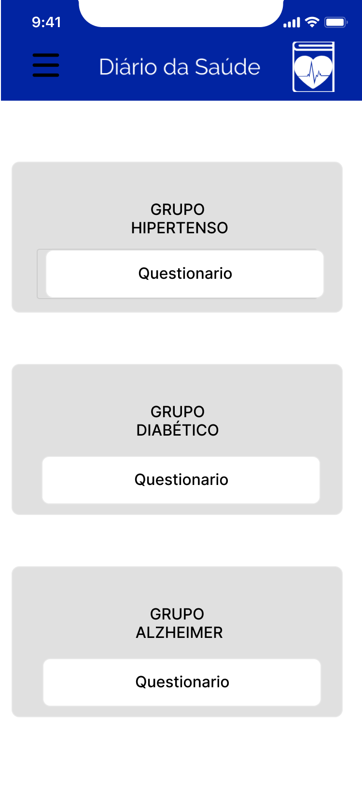
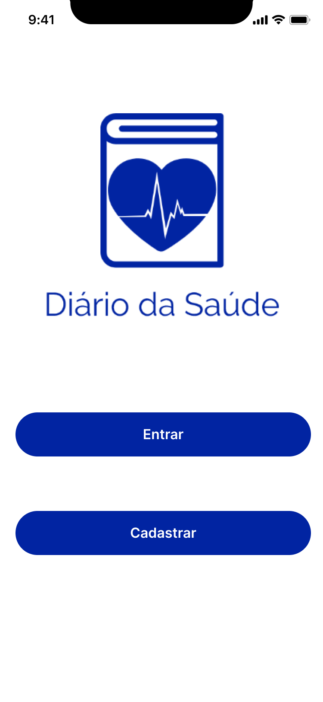
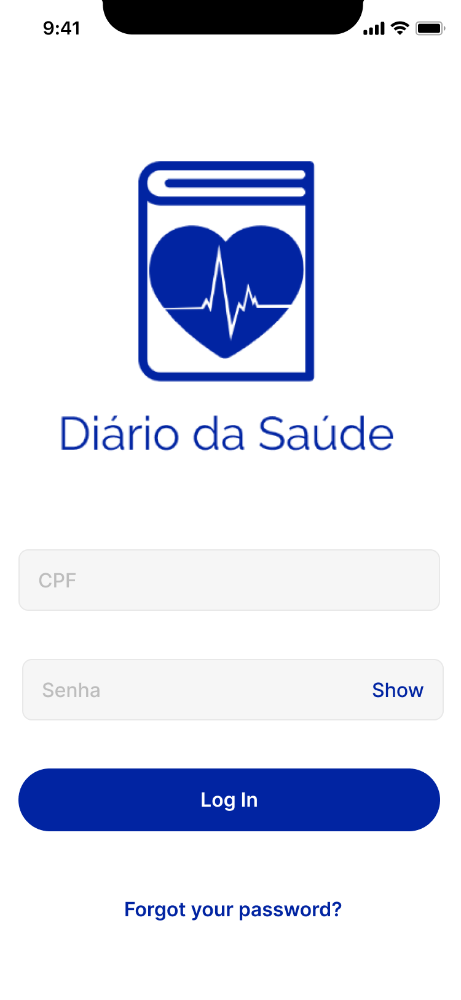
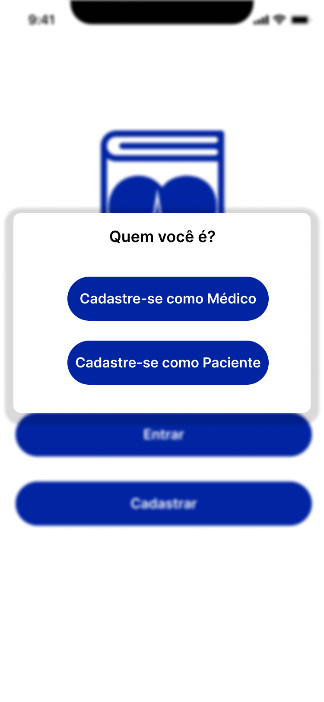
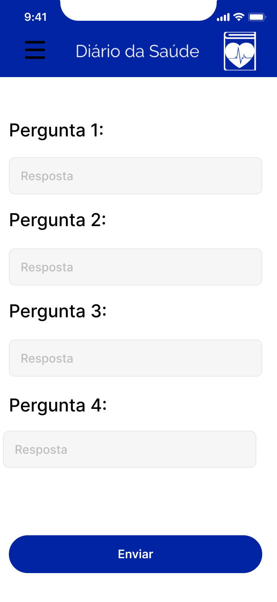
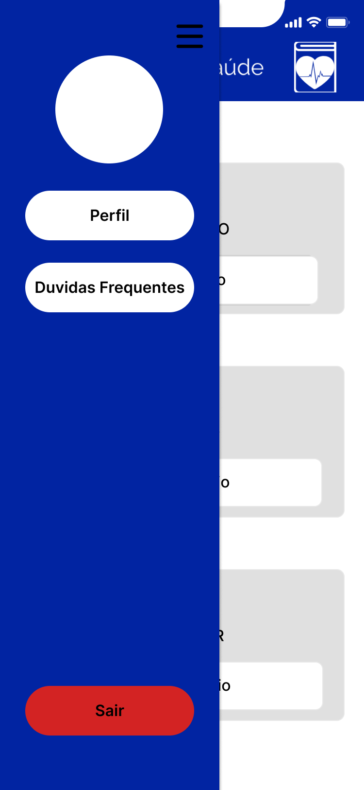

# Protótipo
## Versionamento
| Data | Versão | Descrição | Autores |
| :---: | :---: | :---: | :---: |
| 04/09/2020 | 0.1 | Criação do documento | [André Goretti](https://github.com/AGoretti)|

## Introdução

&emsp;&emsp;Criamos um protótipo com o objetivo de visualizar melhor como um aplicativo vai se comportar. pra isso geramos um protótipo com funcionalidade com troca de telas para simular rotinas de um usuário.  

## Protótipo

o protótipo se encontra nesse [link](https://www.figma.com/file/d0icSO7UVLvEIMhBIl0OV1/Di%C3%A1rio-da-Sa%C3%BAde?node-id=0%3A1)

## Versão 1:

