# Questionário

## Versionamento

| Data | Versão | Descrição | Autor(es) |
|----| ---- | ------- | ------- |
| 09/09/2020 | 0.1 | Versão inicial | [Rodrigo Dadamos](https://github.com/Rdadamos) |
| 09/09/2020 | 0.2 | Corrigindo título e adicionando hyperlink | [Murilo Loiola](https://github.com/murilo-dan) |
| 09/09/2020 | 0.3 | Adicionando tabelas de requisitos | [André Goretti](https://github.com/AGoretti) |
| 10/09/2020 | 0.4 | Adição das respostas | [Rodrigo Dadamos](https://github.com/Rdadamos) |

Observação: este artefato foi elaborado durante a realização do <a href="https://unbarqdsw.github.io/2020.1_G5_Diario_da_Saude/design_sprint/">Design Sprint</a>.

## Introdução

&emsp;&emsp;O objetivo deste questionário é ampliar o conhecimento sobre grupos de acompanhamentos de pacientes das UBS e entender a necessidade de um software para gerenciar esses grupos e contrubuir com a prevenção e promoção da saúde, ainda mais considerando o cenário atual de pandemia.

## Aplicação

&emsp;&emsp;Respeitando o isolamento social, o questionário foi divulgado em grupos de Whatsapp de servidores da Secretária de Saúde do Distrito Federal (SES-DF). Esses grupos possuem diversas categorias de profissionais da saúde.

## Perguntas

&emsp;&emsp;O questionário aplicado pode ser visualizado <a href="https://docs.google.com/forms/d/e/1FAIpQLSfBneVeqSsY-roqyC_oOxlLIvUHNUrsOe5dHRT1bOfn2-pjZg/viewform" target="_blank">aqui</a>.

## Respostas

&emsp;&emsp;As respostas coletadas foram:

[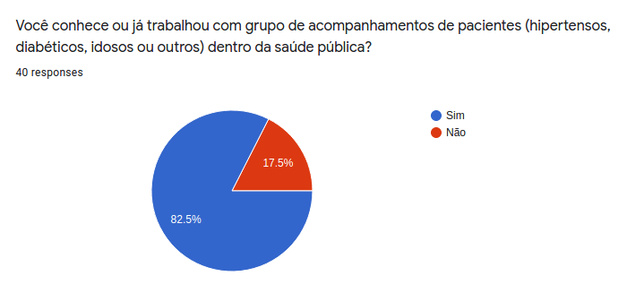](./img/questionario/resp_1.png)

[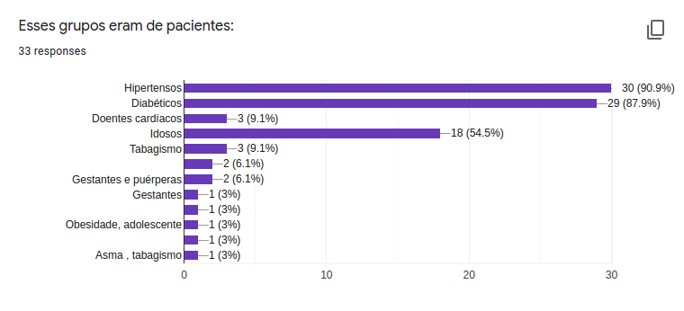](./img/questionario/resp_2.png)

[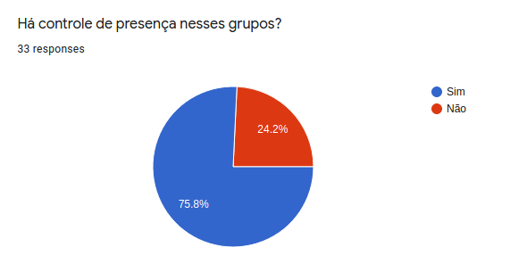](./img/questionario/resp_4.png)

[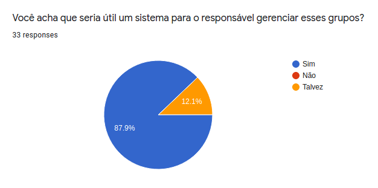](./img/questionario/resp_6.png)

[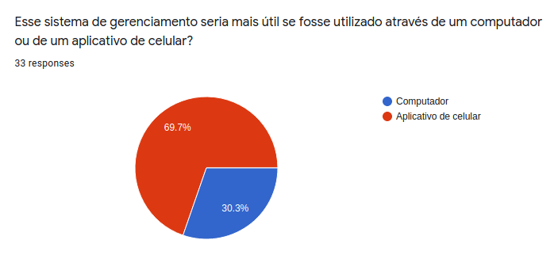](./img/questionario/resp_7.png)

Funcionalidades que seriam úteis nesse sistema de gerenciamento:

&emsp;&emsp;(1) pouco útil; (5) muito útil

[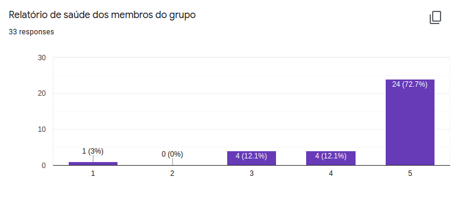](./img/questionario/resp_8.png)

[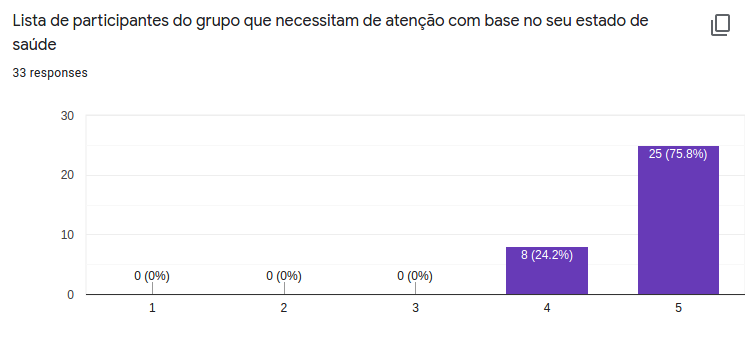](./img/questionario/resp_9.png)

[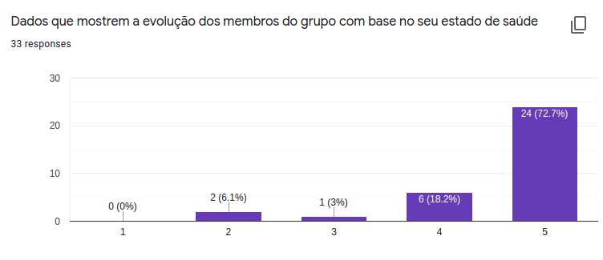](./img/questionario/resp_10.png)

[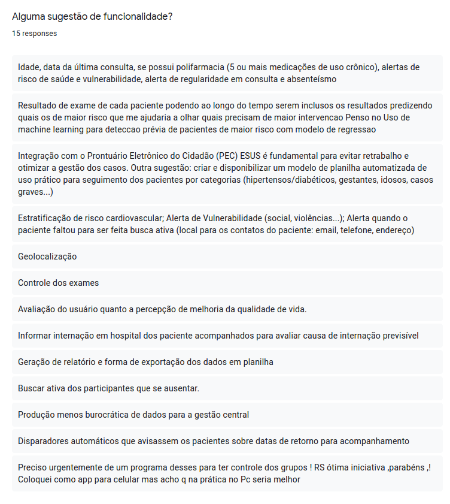](./img/questionario/resp_11.png)

Funcionalidades que seriam úteis para o aplicativo dos pacientes:

&emsp;&emsp;(1) pouco útil; (5) muito útil

[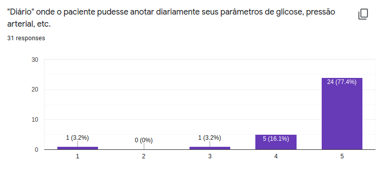](./img/questionario/resp_13.png)

[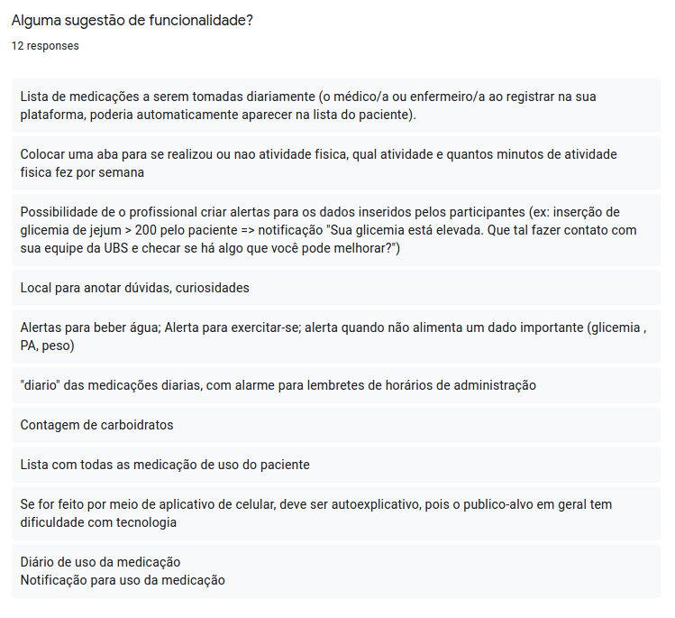](./img/questionario/resp_15.png)

## Requisitos Elicitados
### Requisitos Funcionais
| Código | Descrição | Prioridade |
| -- | -- | -- |
| RF01 | Chamada para controle de participação. | Should |
| RF02 | Push Notifications para lembretes de consultas, remédios, orientações...| Could |
| RF03 | Geração de relatório e forma de exportação dos dados em planilha. | Must |
| RF04 | Colocar uma aba para se realizou ou nao e qual a atividade fisica. | Could |
| RF05 | Lista de medicações a serem tomadas diariamente. | Should |
| RF06 | Local para anotar dúvidas, curiosidades. | Would |
| RF07 | Possibilidade de o profissional criar alertas para os dados inseridos pelos participantes | Could |

### Requisitos Não Funcionais

| Código | Descrição | Prioridade |
| -- | -- | -- |
| RNF01 | Machine learning para prioridades de internações e exames. | Would |
| RNF02 | Busca ativa dos participantes que se ausentarem. | Would |
| RNF03 | Controle dos exames dos pacientes | Could |
