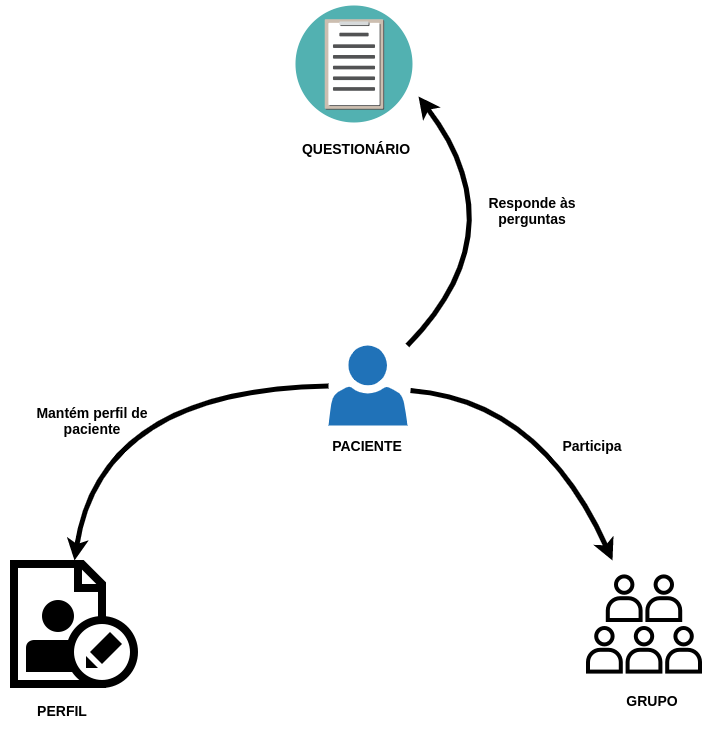
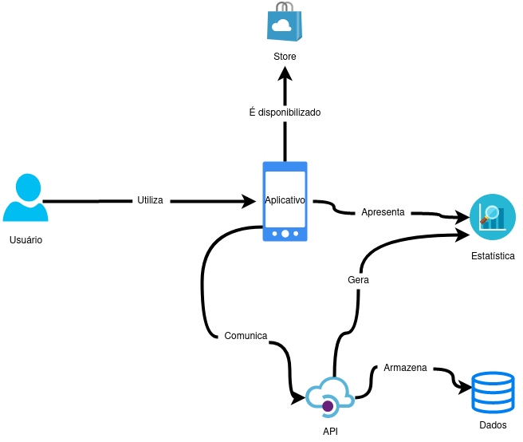

# Rich Picture
## Versionamento
| Data | Versão | Descrição | Autor(es) |
|:----:|:------:|:---------:|:---------:|
| 06/09/2020 | 0.1 | Criação do Documento | [Gustavo Carvalho](https://github.com/gustavocarvalho1002) |
| 06/09/2020 | 0.2 | Adicionando rich picture de paciente | [Murilo Loiola](https://github.com/murilo-dan) |
| 06/09/2020 | 0.3 | Adição do Rich Picture de aplicativo | [Gabriel Tiveron](https://github.com/GabrielTiveron) |

Observação: este artefato foi elaborado durante a realização do <a href="https://unbarqdsw.github.io/2020.1_G5_Diario_da_Saude/design_sprint/">Design Sprint</a>.

## Definição

&emsp;&emsp;Rich Picture é uma técnica simples de modelagem com o objetivo de analisar problemas e expressar ideias. Das vantagens de se utilizar essa técnica, algumas serão citadas abaixo:

- Rápida identificação de requisitos.
- Rápida identificacão de atores.
- Auxilia na análise de processos.
- Estabele relacionamentos entre atores.
- Fácil de modelar e pode ser feito com o cliente.

## Rich pictures
### Contexto
#### Cenário atual
##### Autor: Rodrigo Dadamos

### Profissional saúde
##### Autor: Gustavo Carvalho

### Paciente
##### Autor: Murilo Loiola

### Aplicativo
##### Autor: Gabriel Tiveron

