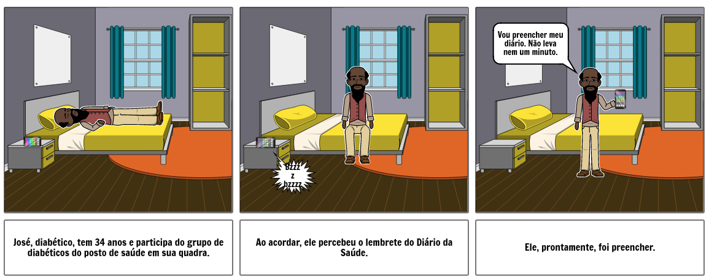

# Storyboard
## Versionamento
| Data | Versão | Descrição | Autor(es) |
|:----:|:------:|:---------:|:---------:|
| 05/09/2020 | 0.1 | Criação do Documento | [Gustavo Carvalho](https://github.com/gustavocarvalho1002), [Gabriel Tiveron](https://github.com/GabrielTiveron), [Murilo Loiola](https://github.com/murilo-dan) |
| 08/09/2020 | 0.2 | Adição de definição e adicionando caminho no índice| [Murilo Loiola](https://github.com/murilo-dan) |

Observação: este artefato foi elaborado durante a realização do <a href="https://unbarqdsw.github.io/2020.1_G5_Diario_da_Saude/design_sprint/">Design Sprint</a>.

## Definição

&emsp;&emsp;Storyboard é uma ferramenta que tem como objetivo apresentar uma ideia visualmente. Consiste de uma série de ilustrações ou imagens dispostas em sequência de forma a representar uma história. &emsp;&emsp;Na área de desenvolvimento de software, os storyboards são aplicados na identificação das especificações de uma parte do software. Normalmente apresentam as etapas mais importantes para uma boa experiência de usuário, de forma a serem de fácil entendimento e manutenção.

## Story board
### Paciente

### Profissional da saúde
